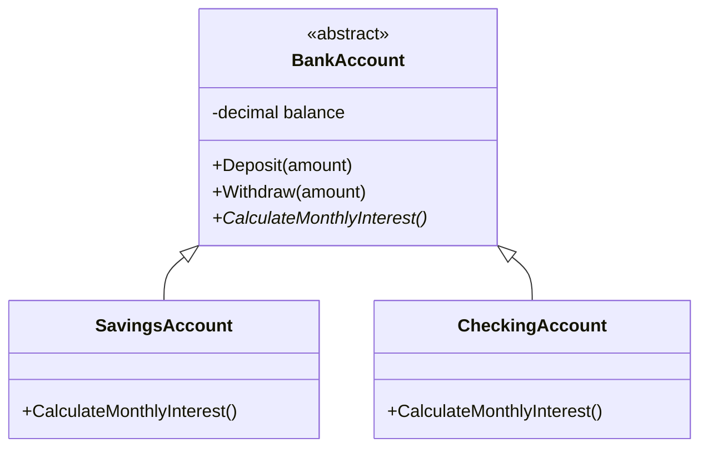
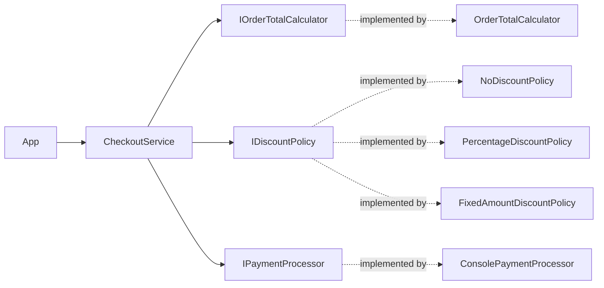

# Learning OOP and SOLID in C#

This solution is a small, runnable set of examples. The `example.oops` library models bank accounts, the `example.solid` library models checkout and office devices, and `example.app` runs both demonstrations.

Run it from the solution directory:

```sh
dotnet run --project example.app
```

The account interest and console payment processor are deliberately simple teaching examples, not production banking or payment code.

## Object-Oriented Programming

Object-oriented programming (OOP) organizes code around objects: values that contain state and operations that work on that state. The bank-account example brings four common OOP ideas together.



### Encapsulation

Encapsulation keeps an object's data together with the operations that are allowed to change it. In [BankAccount.cs](example.oops/BankAccount.cs), `_balance` is private, so other code cannot assign any value to it. Instead, it calls `Deposit` or `Withdraw`, which reject invalid amounts and prevent withdrawing more than the current balance.

This protects the account from ending up in an invalid state. `Balance` is readable from outside, but only account methods can change the underlying field.

### Abstraction

Abstraction shows the operations that callers need while hiding details they do not need. `BankAccount` is abstract: callers can work with an account's owner, balance, deposits, and withdrawals without knowing the exact account type. It requires each concrete account to provide an `AccountType` and a `CalculateMonthlyInterest` implementation.

The app cannot create a plain `BankAccount`, because the base type does not define a meaningful interest rule. It creates a `SavingsAccount` or `CheckingAccount` instead.

### Inheritance

Inheritance lets a specialized class reuse behavior from a more general class. [SavingsAccount.cs](example.oops/SavingsAccount.cs) and [CheckingAccount.cs](example.oops/CheckingAccount.cs) inherit the common owner, balance, deposit, and withdrawal behavior from `BankAccount`. Each class supplies its own account-specific details.

Inheritance is useful when types truly share behavior. It should not be used only to avoid writing a few repeated lines.

### Polymorphism

Polymorphism means using one shared type while allowing each concrete object to respond in its own way. In [Program.cs](example.app/Program.cs), both account objects are stored in a `BankAccount[]`. The loop calls `CalculateMonthlyInterest` without checking which account it has; savings accounts calculate interest, while checking accounts return zero.

This keeps the calling code simple when new account types are added.

## SOLID Principles

SOLID is a group of five design guidelines for keeping object-oriented code easier to change. They are guidelines, not rules that require an interface or class for every line of code.

The checkout flow uses constructor injection: the app chooses implementations, while `CheckoutService` works with interfaces.



### S: Single Responsibility Principle

A class should have one focused responsibility, so a change to one job does not unnecessarily affect unrelated jobs.

- `Order` holds the order's items.
- `OrderTotalCalculator` calculates the subtotal.
- `ReceiptFormatter` formats receipt text.
- `CheckoutService` coordinates the checkout steps.

For example, changing receipt wording belongs in `ReceiptFormatter`, not in the class that calculates prices.

### O: Open-Closed Principle

Software entities should be open for extension but closed for modification: new behavior should often be added by introducing a new implementation rather than editing stable coordinating code.

`CheckoutService` receives an `IDiscountPolicy`. `NoDiscountPolicy`, `PercentageDiscountPolicy`, and `FixedAmountDiscountPolicy` are three options. A future `CouponDiscountPolicy` could implement the same interface without adding another discount branch inside `CheckoutService`.

### L: Liskov Substitution Principle

An implementation should be usable anywhere its interface or base type is expected, without surprising the caller or breaking the promised behavior.

The app assigns `NoDiscountPolicy` and then `PercentageDiscountPolicy` to the same `IDiscountPolicy` variable and applies each to the same subtotal. `FixedAmountDiscountPolicy` is another implementation: it subtracts a set amount but never reduces the total below zero. All three follow the policy contract: for a non-negative subtotal, they return a total from zero through the original subtotal. A policy that returned a negative total or more than the subtotal would break that contract.

### I: Interface Segregation Principle

Prefer small interfaces for distinct capabilities over one large interface that forces every implementation to provide unrelated operations.

In [OfficeDevices.cs](example.solid/OfficeDevices.cs), printing and scanning are separate interfaces. `BasicPrinter` implements only `IPrinter`, while `OfficeMachine` implements both `IPrinter` and `IScanner`. A printer that cannot scan is not required to pretend that it can.

### D: Dependency Inversion Principle

High-level workflows should depend on abstractions, not directly on low-level details. This makes implementations easier to replace and the workflow easier to test.

`CheckoutService` depends on `IOrderTotalCalculator`, `IDiscountPolicy`, and `IPaymentProcessor`. The app supplies `OrderTotalCalculator`, a chosen discount policy, and `ConsolePaymentProcessor`. A different payment processor could be supplied without changing the checkout steps.

## Where to Look

- [BankAccount.cs](example.oops/BankAccount.cs): shared account behavior, encapsulation, and abstraction.
- [SavingsAccount.cs](example.oops/SavingsAccount.cs) and [CheckingAccount.cs](example.oops/CheckingAccount.cs): inheritance and overridden behavior.
- [OrderCheckout.cs](example.solid/OrderCheckout.cs): order responsibilities, discount policies, and dependency injection.
- [OfficeDevices.cs](example.solid/OfficeDevices.cs): small, capability-specific interfaces.
- [Program.cs](example.app/Program.cs): the runnable examples and concrete implementation choices.